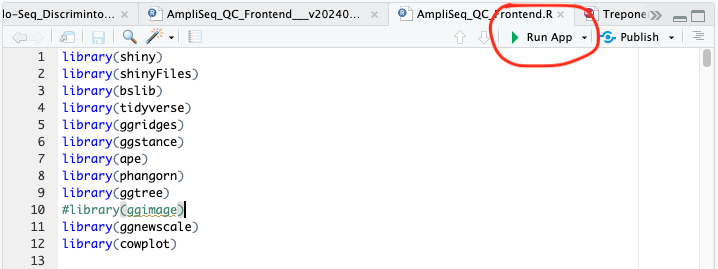
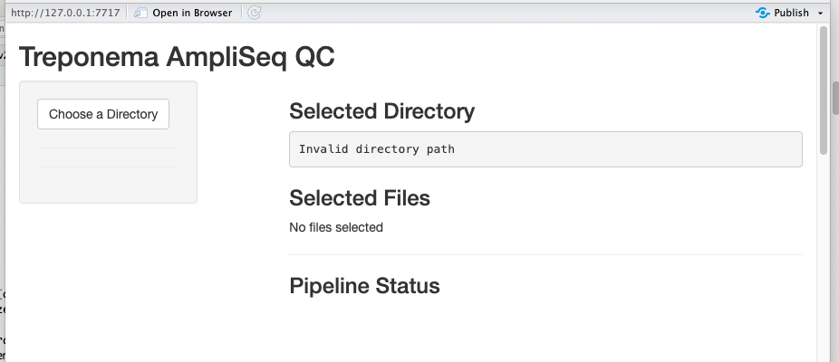
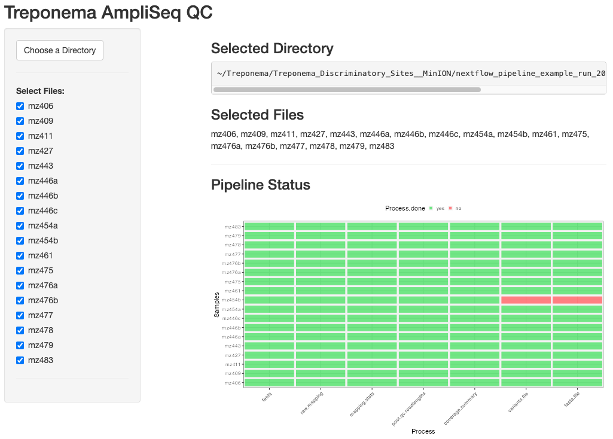
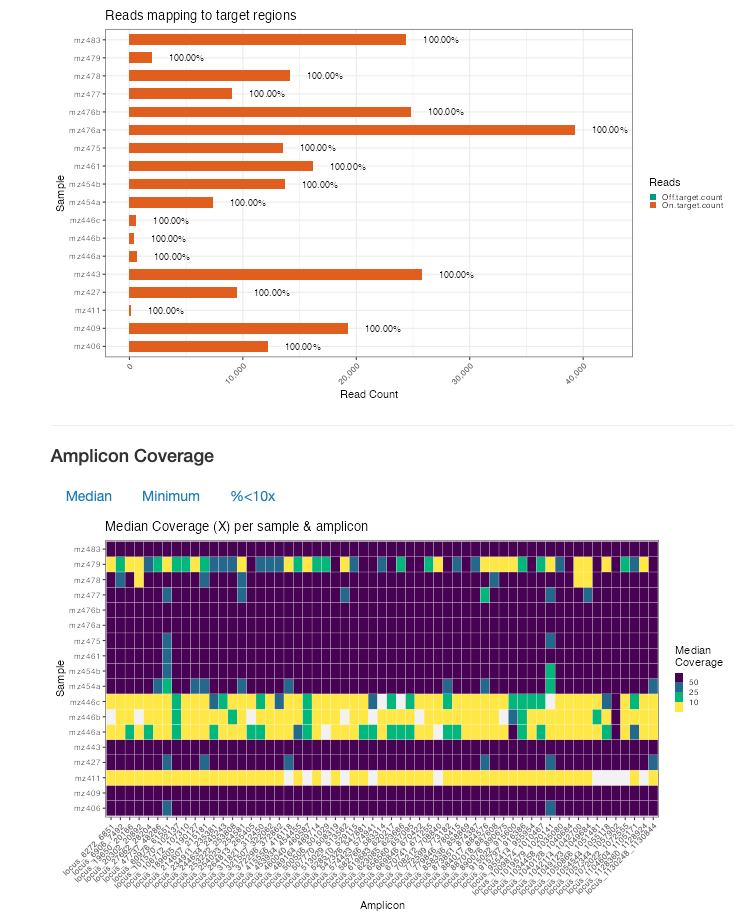
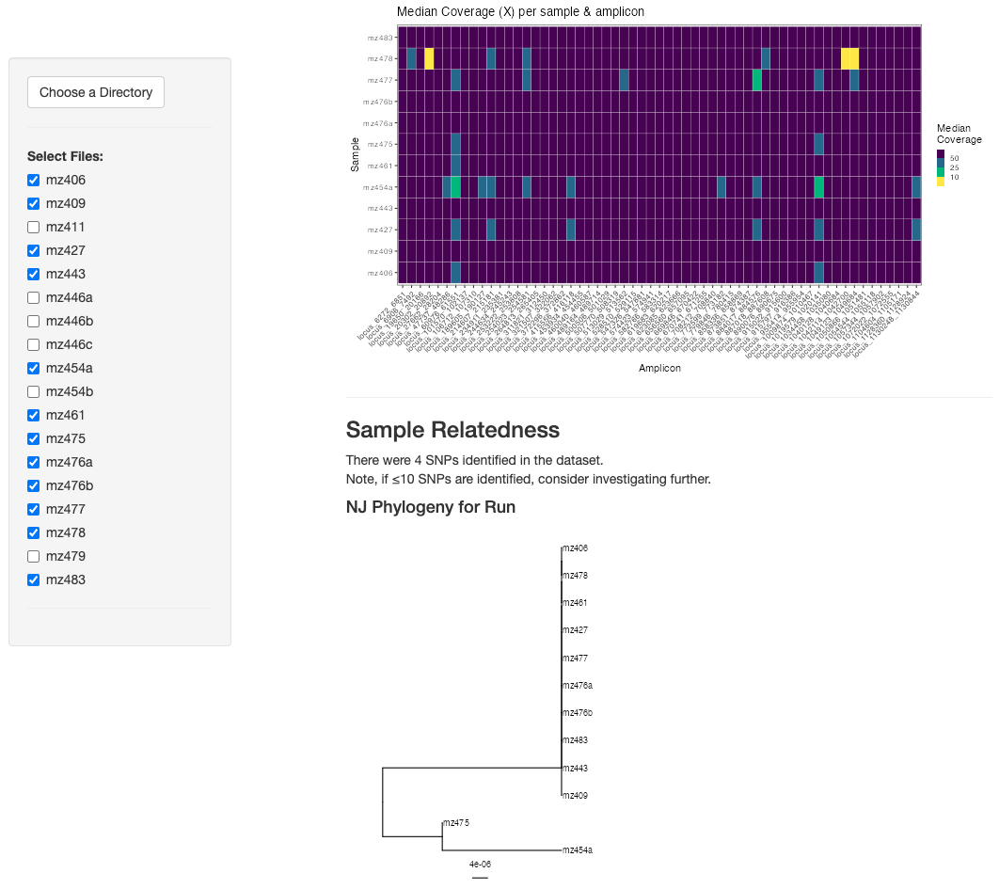
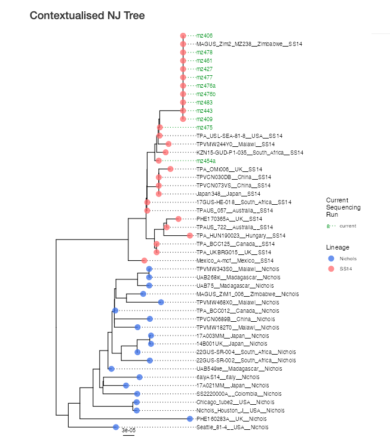

# Quickstart Guide: Running the Pipeline with Zenodo Dataset

To get started, please refer to the Installation Guide provided in the main project README.

## 1. Verify Nextflow Install
After completing the installation, verify that Nextflow is working by running the following command:
```
nextflow run sanger-pathogens/ONTAP --help
```

This command should display a comprehensive help message detailing all available configuration options.

## 2. Download Zenodo Dataset
Access the dataset from Zenodo at the following URL:

```
https://zenodo.org/records/15181157
```
In the Files section, click the Download all button. This will initiate the download of a ZIP archive containing the dataset. Once extracted, the dataset will require approximately 5 GB of storage.

## 3. Organise the Dataset
After unzipping the archive, move all .pod5 files into a dedicated subdirectory:
```
mkdir pod5
mv *.pod5 pod5
```
> **_NOTE_** for this example I have assumed you have named the directory of saved files "phylo-plex-data"

## 4. Running the Pipeline
Replace the placeholder values (<...>) with the appropriate absolute paths for your system, and run the pipeline as follows:
```
nextflow run sanger-pathogens/ONTAP \
    --raw_read_dir phylo-plex-data/pod5 \
    --reference NC_021508.1.mask-Ribosomal-Operon2.fasta \
    --primers TP-Discriminatory-primers.20230208_23S-v1.fas \
    --target_regions_bed fixed.bed \
    --additional_metadata zim_metadata.csv \
    --dorado_local_path <absolute path to Dorado executable> \
    --clair3_model <absolute path to Clair3 models>/r1041_e82_400bps_hac_v430 \
    -profile laptop
```

> **_Recommendation_** When using the default basecalling method, we recommend the Clair3 model r1041_e82_400bps_hac_v430, as it matches the expected basecalling configuration.

## 5. Shiny app integration

After running the pipeline please follow the instructions below to start up the shiny app to interogate the results which is included in the main repo.

### Open `AmpliSeq_QC_Frontend.R` in RStudio



Ensure all listed R packages are installed in your Rstudio environment.

Select `Run App` to launch (this can be done within Rstudio's native browser or in a web browser).



Click `Select Directory` and navigate to the `results` directory of a completed `ONTAP` analysis run. 

The app will locate samples in the directory and provide a summary dashboard on which processes have successsfully completed:



Samples which have incomplete processes can be deselected using the tickbox on the left hand side, and the app will dynamically update all plots. 

> **_Note_** Some plots (e.g. phylogenies) will not generate if there are incomplete processes, and these samples should be deselected before proceeding.

Quality control metrics can be assessed, enabling additional samples (e.g. those with insufficient coverage to be deselected from analysis. 



In  this example, we should deselect samples mz454b, mz446a, mz446b, mz446c, mz411 and mz479.



The App has automatically generated a Neighbour Joining tree our our samples (using the consensus of the concatenated amplicons). The app also places the new samples into context with existing data, using a presupplied multiple sequence alignment. 



New samples are labelled in green, and tip points have been coloured according to the main <i>T. pallidum</i> lineages (Nichols and SS14). New samples are automatically classified into lineages based on phylogenetic placement. 

The app also includes a searchable table summarising lineage and macrolide resistance alleles inferred. 
